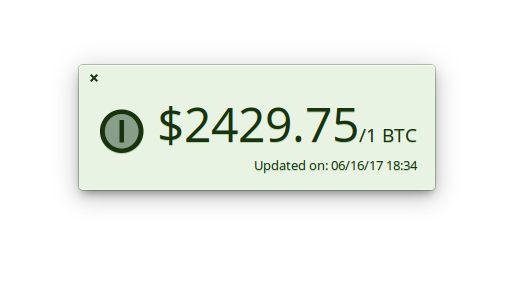

#  Coin
## Track the virtual currencies in real world currency value.
[](https://appcenter.elementary.io/com.github.lainsce.coin)



## Dependencies

Please make sure you have these dependencies first before building.

```
granite
gtk+-3.0
meson
libsoup2.4
libjson-glib
```

## Building

Simply clone this repo, then:

```
$ meson build && cd build
$ meson configure -Dprefix=/usr
$ sudo ninja install
```
